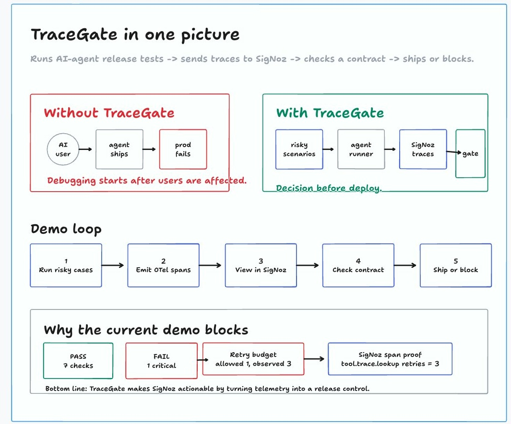

# TraceGate

Observability contracts and CI release gates for AI agents, powered by SigNoz and OpenTelemetry.

[](https://nodejs.org/)
[](https://opentelemetry.io/)
[](https://signoz.io/)
[](LICENSE)

TraceGate runs realistic AI-agent release scenarios, sends the run telemetry to SigNoz, and evaluates whether the agent is observable enough to ship. If the agent would be hard to debug in production, the release is blocked before deploy.



## Contents

- [Why TraceGate](#why-tracegate)
- [Demo](#demo)
- [What It Checks](#what-it-checks)
- [Quickstart](#quickstart)
- [Web Workbench](#web-workbench)
- [SigNoz Integration](#signoz-integration)
- [Project Structure](#project-structure)
- [Configuration](#configuration)
- [Verification](#verification)
- [Deploying](#deploying)

## Why TraceGate

AI agent releases usually fail in ways that are hard to reconstruct later: an LLM call is not traced, a tool retry spike is hidden, cost metadata is missing, or the team has no direct path from "release failed" to "open this SigNoz evidence."

TraceGate turns those observability requirements into a release contract:

- required root, LLM, and tool spans
- required model and cost attributes
- scenario-level pass/fail expectations
- retry and cost budgets
- SigNoz query prompts, dashboards, and alert artifacts

The default demo intentionally blocks the release because `trace.lookup` retries three times against a max retry budget of one. That is the point: TraceGate proves that observability can become a pre-deploy control, not only a post-incident dashboard.

## Demo

```sh
npm install
npm run demo -- --no-telemetry
```

Expected result:

```text
TraceGate FAIL
Checks: 7/8 passed
Critical failures: 1
FAIL retry-budget-trace-lookup - Worst retry count for 'trace.lookup' was 3; limit 1.
```

Run the web workbench:

```sh
npm run web:dev
```

Then open `http://localhost:5173`.

## What It Checks

| Gate area | Why it matters | Default demo evidence |
| --- | --- | --- |
| Root run span | Every release attempt needs one traceable parent | `agent.run` |
| LLM tracing | Model calls must be observable | `llm.call` |
| Model metadata | Debugging needs the model name | `gen_ai.request.model` |
| Cost metadata | AI spend should be reviewable per run | `tracegate.cost.usd` |
| Tool retry budget | Tool instability should block unsafe releases | `trace.lookup` retries `3`, limit `1` |
| Scenario outcome | Release scenarios must satisfy expectations | refund and prompt-injection scenarios pass |
| SigNoz artifacts | Teams need queries, dashboards, and alerts | suggested queries and alert YAML |

## Quickstart

```sh
git clone git@github.com:CodeswithrohStudio/TraceGate.git
cd TraceGate
npm install
npm run check
npm test
npm run demo -- --no-telemetry
```

Useful commands:

```sh
npm run demo
npm run demo:report
npm run web:dev
npm run web:build
npm run lint
```

The default deterministic mode works without an LLM API key. If `OPENAI_API_KEY` is present, TraceGate can run the demo agent with OpenAI model calls and still evaluate the same observability contract.

## Web Workbench

The web app includes a landing page and an operational workbench:

- landing page for the product story and evidence
- release verdict dashboard
- contract check matrix
- scenario timeline
- evidence drawer for failed checks
- SigNoz status and suggested investigation prompts
- live "Run Gate" action backed by local or Vercel API endpoints

Local development uses `apps/web/server.mjs` so the UI can call `/api/status`, `/api/report`, and `/api/run`. Vercel uses serverless functions in `api/` for the same routes.

## SigNoz Integration

TraceGate is designed to expand SigNoz from "inspect telemetry after something breaks" to "decide whether an AI-agent release can ship."

Local SigNoz flow:

```sh
npm run signoz:patch-foundry
foundryctl gauge -f casting.yaml
foundryctl cast -f casting.yaml
OTEL_EXPORTER_OTLP_ENDPOINT=http://127.0.0.1:4318 npm run demo
```

Verified local endpoints:

| Service | Local URL |
| --- | --- |
| SigNoz UI | `http://localhost:8080` |
| OTLP HTTP collector | `http://localhost:4318` |
| SigNoz MCP | `http://localhost:8000/mcp` |

SigNoz artifacts live in:

- `signoz/dashboard-outline.md`
- `signoz/alerts.yaml`
- `signoz/investigation-prompts.md`

## Project Structure

```text
apps/web              React landing page and release workbench
api                   Vercel serverless API routes
contracts             Observability contract YAML
docs                  Product, setup, and verification notes
packages/core         Contract schema, evaluator, reports, scenario loader
packages/demo-agent   Intentionally imperfect AI support agent
packages/cli          tracegate CLI
scenarios             Release scenario suites
signoz                Dashboard, alert, and investigation artifacts
```

## Configuration

Create `.env.local` when you want live model calls or custom SigNoz endpoints:

```sh
cp .env.example .env.local
```

Supported values:

```sh
OPENAI_API_KEY=...
TRACEGATE_OPENAI_MODEL=gpt-4.1-mini
OTEL_EXPORTER_OTLP_ENDPOINT=http://127.0.0.1:4318
SIGNOZ_UI_URL=http://localhost:8080
SIGNOZ_MCP_URL=http://localhost:8000/mcp
```

Never commit `.env.local`. It is ignored locally and excluded from Vercel uploads.

## Verification

Current verified checks:

- `npm run check`
- `npm run lint`
- `npm test`
- `npm run web:build`
- deterministic API run through the web app
- OpenAI-backed API run through the web app when a local key is configured
- local SigNoz telemetry export via OTLP HTTP
- ClickHouse span verification for `agent.run`, `llm.call`, `tool.ticket.lookup`, `tool.policy.search`, and `tool.trace.lookup`

See [docs/VERIFICATION.md](docs/VERIFICATION.md) for the full log.

## Deploying

Vercel is configured with:

- build command: `npm run build && npm run web:build`
- output directory: `apps/web/dist`
- serverless routes: `/api/status`, `/api/report`, `/api/run`

Deploy:

```sh
vercel --prod
```

Optional production environment variables:

```sh
OPENAI_API_KEY
TRACEGATE_OPENAI_MODEL
SIGNOZ_UI_URL
SIGNOZ_MCP_URL
OTEL_EXPORTER_OTLP_ENDPOINT
```

The deployed demo still works without `OPENAI_API_KEY` by using deterministic agent mode.

## License

Apache-2.0
